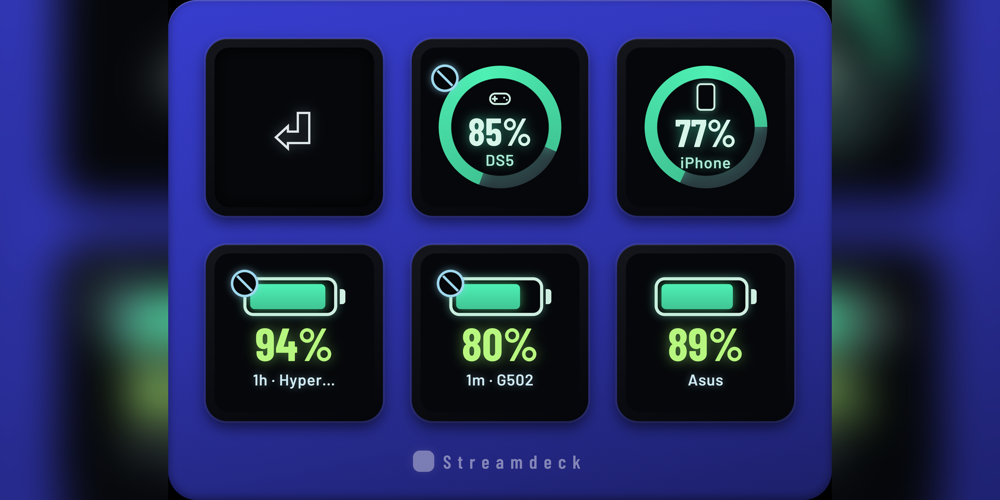

# Stream Deck plugins

Stream Deck plugins by [Emil Berglund](https://github.com/EmilB04). One directory
per plugin, each self-contained: its own `package.json`, build, tests and docs.

## Plugins

| Plugin | What it does | Platform | Download |
|---|---|---|---|
| [**Battery Monitor**](BatteryMonitor/) | Battery level of auto-detected wireless peripherals — headsets, mice, keyboards, controllers and paired Bluetooth devices — on a key, with a low warning and a "whatever is emptiest" key. | Windows 10+ | [Latest release](https://github.com/EmilB04/StreamDeck/releases/latest) |

### Battery Monitor

[](BatteryMonitor/)

A controller, a phone, a headset, a mouse and a keyboard — five keys, no model
list anywhere in the code. More screenshots in the
[plugin README](BatteryMonitor/README.md#what-it-looks-like).

## Install a plugin

1. Download the `.streamDeckPlugin` file from the
   [latest release](https://github.com/EmilB04/StreamDeck/releases/latest).
2. Double-click it. The Stream Deck app installs it and asks for nothing else.
3. Drag one of the plugin's actions onto a key.

Removing it again is Stream Deck's own uninstall — right-click the plugin in the
store pane, no leftovers to clean up by hand.

Battery Monitor also needs Node.js 20+ on the machine running Stream Deck, and
[HeadsetControl](https://github.com/Sapd/HeadsetControl/releases) on `PATH` if you
want headset support. Full requirements are in
[its release notes](BatteryMonitor/RELEASE-NOTES.md).

## Build from source

Each plugin builds on its own. For Battery Monitor:

```sh
cd BatteryMonitor
npm install
npm run pack        # -> dist/com.emilberglund.batterymonitor.streamDeckPlugin
```

`npm run pack` produces the same file the releases carry, so you can test a build
before it ships. To develop against a live Stream Deck instead, `npx @elgato/cli
link` the `.sdPlugin` folder and use `npm run watch`; see the
[plugin README](BatteryMonitor/README.md) for the full loop.

Checks that run on every push and pull request (`.github/workflows/ci.yml`):

```sh
npm run typecheck && npm run lint && npm run format:check && npm test
```

## Releasing

Push a tag of the form `<plugin>-v<version>` — `battery-monitor-v1.1.0`.
`.github/workflows/release.yml` builds that plugin, packs it, and attaches the
`.streamDeckPlugin` file to a GitHub release. `workflow_dispatch` on the same
workflow packs without releasing, leaving the file as a build artifact.

## Adding a plugin

New plugin, new top-level directory. Add a row to the table above, a tag prefix
case in `release.yml`, and a job or matrix entry in `ci.yml`.

## Licence

MIT with attribution — see [LICENSE](LICENSE).
